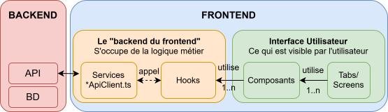

# Bienvenue dans le guide de contribution du projet

Dans ce guide, vous trouverez un descriptif expliquant comment contribuer. Veuillez vous référer à la table des matières pour avoir un aperçu des sujets traités:

  - [Prérequis](#prérequis)
  - [Utilisation de git et github](#utilisation-de-git-et-github)
    - [Gestion des branches](#gestion-des-branches)
    - [Gestion des commits](#gestion-des-commits)
    - [Gestion des issues](#gestion-des-issues)
  - [Contribution au code source](#contribution-au-code-source)
      - [Structure du frontend](#structure-du-frontend)
      - [Étapes de Développement](#étapes-de-développement)
      - [Routeur d'expo](#routeur-dexpo)

# Prérequis

Nous supposons que vous avez déjà suivi les prérequis du fichier `README.md`. 
Nous recommandons d'utiliser VSCode avec les extensions suivantes :
- GitGraph
- Thunder Client
- ES7+ React/Redux/React-Native Snippets
- ESLint

# Utilisation de git et github

## Gestion des branches
### Créer une branche pour chaque nouvelle fonctionnalité

- Vous devez créer une nouvelle branche pour la fonctionnalité que vous souhaitez ajouter au projet.
- Le type de branche doit être spécifié comme suit : 
  - **`feat/`** pour une nouvelle fonctionnalité.
  - **`bugfix/`** pour une correction de bug.

### Demande de Fusion (Merge Request)

- Vous devez créer une demande de fusion pour fusionner votre branche dans la branche `main`.
- Une demande de fusion se crée depuis l'interface web de GitHub.
- Vous pouvez trouver plus d'informations sur les demandes de fusion ici :
    - [GitHub](https://docs.github.com/en/github/collaborating-with-issues-and-pull-requests/creating-a-pull-request)

`NB`: Si vous poussez du code dans la branche `main` et qu'il ne passe pas les tests, le workflow GitHub sera dans un état de **failure**.

```bash
npm run test
```


## Gestion des commits

`NB`: Vous ne pourrez pas commit du code ne respectant pas les règles de format définies par le linter.

### Linter
```bash
npm run lint
```
- Nous utilisons [ESLint](https://eslint.org/) pour effectuer la vérification (linting) du frontend et [Prettier](https://prettier.io/) pour formater le code.
La configuration de ESLint se trouve dans le fichier `.eslintrc.js.

### Husky

- Husky est un outil qui permet d'exécuter des scripts lorsque vous effectuez un commit ou un push de votre code.
- Les scripts sont définis dans le répertoire `.husky`
- Pour apprendre davantage sur [Husky](https://typicode.github.io/husky/#/)
- **Lors de chaque commit**, un hook pre-commit est déclenché. Ce hook exécute automatiquement le linting du code avant que le commit ne soit effectué.

## Gestion des issues
### Créer une nouvelle issue
Si vous constatez un problème avec le projet, vérifiez si une [issue existe déjà](https://github.com/Tri-omph/frontend/issues). **Si c'est le cas**, ajoutez un commentaire à l'issue existante. **Si ce n'est pas le cas**, créez une nouvelle issue.

### Résoudre une issue
Parcourez les issues existantes pour en trouver une qui vous intéresse. En règle générale, **nous n'assignons pas les issues**. Si vous trouvez une issue à résoudre, vous êtes libre d'ouvrir une `Merge request` avec une solution.

### Notation des issues
Afin de retrouver facilement les issues et d'identifier leur niveau de priorité, nous utilisons des labels pour les catégoriser. Voici quelques exemples de labels que vous pouvez rencontrer **(non exhaustif)** :
- **bug** : Pour les problèmes ou les erreurs à résoudre.
- **enhancement** : Pour les améliorations ou les nouvelles fonctionnalités proposées.

#### Priorités
Nous attribuons également des labels de priorité pour mieux gérer l'ordre des tâches.

- **Bloquant** : Pour les problèmes qui empêchent toute progression.
- **Haut** : Pour les problèmes importants à résoudre rapidement.
- **Moyen** : Pour les problèmes moins urgents, mais qui nécessitent une attention.
- **Faible** : Pour les problèmes mineurs qui peuvent être traités plus tard.

Utilisez les labels de manière cohérente pour faciliter la recherche et la gestion des issues.


# Contribution au code source

## Structure du frontend

Voici une représentation simplifiée de la structure du frontend de notre projet.

<div align="center">
  
  <p><em>Figure 1 : Schéma de la structure du Frontend.</em></p>
</div>

## Étapes de Développement

1. **Analyse et Identification à partir de Figma**  
    - Examinez la maquette [Figma](https://www.figma.com/design/ubqXnJji9YN4SbcfynERxk/tri'omph-project?node-id=0-1&node-type=canvas&t=iB9U2BsWW1mxEehF-0).  
    - Identifiez les **tabs** et **screens** principaux de l'application. (`NB` Les tabs ont été mis en place en même temps que la structure de base, mais vous devez ajouter vos propres screens dans le dossier `app/(screens)/...`).

2. **Définition des Composants Réutilisables**
    - Repérez les **formats ou structures récurrents**, communs à plusieurs tabs/screens. 
   - Créez des **composants dédiés** pour chaque structure récurrente dans le dossier `components`. Vous êtes invités à écrire les tests de vos composants dans `components/__tests__`. Ce n'est pas obligatoire, mais fortement conseillé.
   - Assurez-vous que ces composants encapsulent uniquement la **logique visuelle** et qu'ils soient réutilisables.

3. **Implémentation de la Logique Métier dans des Hooks**  
   - Centralisez la logique métier dans des **hooks personnalisés**, à ajouter dans le dossier `hooks`
   - Les composants visuels appellent ces hooks pour accéder aux données ou exécuter des actions.  
   - Les hooks peuvent être utilisés dans plusieurs composants ou screens.

4. **Communciation avec l'API**

    Toute la logique de communication avec l'API est encapsulée dans le fichier **ApiClient.ts**. Ce fichier fournit les méthodes suivantes : **POST**, **GET**, **PATCH**, **DELETE**

    1. **Définir les endpoints**  
      Les endpoints doivent être définis dans le dossier `endpoints` et sont fournis par la [partie backend du projet](https://github.com/Tri-omph/backend/blob/main/ENDPOINTS.md): 

      ```typescript
      // userEndpoints.ts
      export const ENDPOINTS = {
        CREATE_USER: () => "/users",
      }
      ```

    2. **Créer un manager**

    Les managers regroupent les appels API associés à une `entité spécifique`.

      ```typescript
      // userManager.ts
      import { ENDPOINTS } from "@/services/endpoints/userEndpoints";

      class UserManager {
        static CREATE_USER = (body: {
          username: string;
          password: string;
          email: string;
        }) => {
          return ApiClient.post(ENDPOINTS.CREATE_USER(), "", body);
        };
      }
      ```

`NB`: Vous êtes invités à définir des sous-hiérarchies de dossiers pour une meilleure lisibilité et collaboration. Exemple: `components/user/...`

## Routeur d'expo

### Donner l'accès au routeur

`ATTENTION`: Pour que le routeur d'Expo puisse accéder aux `tabs/screens` de l'application, tous les sous-dossiers de app doivent être entourés de parenthèses

```bash
src/
├── app/                        
│   ├── (tabs)            
│   │   └── index.tsx
│   ├── (screens)            
│   │   ├── (user)/          
│   │   │   ├── user-sign-in.tsx
│   │   │   ├── user-sign-up.tsx
```

### Changer de page

Pour éviter les appels en dur `(par exemple, href="/my-screen")`, vous devez définir vos routes vers vos screens dans le dossier routes et dans le fichier correspondant. 

`NB` : Comme vous avez déjà donné l'accès au routeur, il les trouvera simplement avec leurs noms de fichiers !

```typescript
type UserRoutesKeys = "SIGN_UP";

export const USER_ROUTES: Record<UserRoutesKeys, Routes> = {
  SIGN_IN: createRoute("user-sign-up"), // Car le screen est user-sign-up.tsx
}
```

Vous pouvez désormais faire

```HTML
<Link href={routes.USER.SIGN_UP.getHref()} >
```

Si vous devez attendre la résolution d'une méthode `async` avant de changer de page, utiliser `router.replace()` après votre `await`.